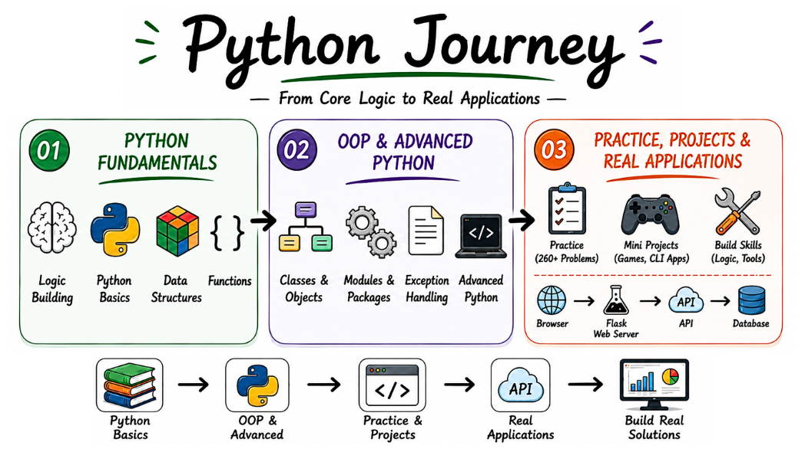

# 🐍 Python Journey: Core Logic & Application Architecture

A structured personal portfolio tracking my progress in Python—moving step-by-step from foundational coding problems to Object-Oriented programming (OOP) notes and complete applications.

[](https://www.python.org/downloads/)
[](#)
[](#)

<p align="center">
  
</p>

---

## 📑 Table of Contents
* [📂 Repository Architecture](#-repository-architecture)
* [🐍 Python Journey](#-python-journey)
* [📓 Core Language Tracks](#-core-language-tracks)
  * [01. Object-Oriented Design Notes](#01-object-oriented-design-notes)
  * [02. Fundamentals](#02-python-fundamentals)
  * [03. Advanced Python](#03-advanced-python)
* [🏗️ Python Projects Gallery](#️-python-projects-gallery)
* [⚙️ Environment Setup](#️-environment-setup)

---

## 📂 Repository Architecture

This repository is organized cleanly by numbers to keep my study notes, practice problems, and projects completely separated.

```text
📁 python-journey/
│
├── 📁 01-oops-notes/
│   ├── 📁 01-class-object/
│   ├── 📁 02-Encapsulation/
│   ├── 📁 03-Inheritance/
│   ├── 📁 04-Polymorphism/
│   └── 📁 05-Abstraction/
│
├── 📁 02-fundamentals-problems/
│   └── 📄 [22 Foundational problems Notebooks]
│
├── 📁 03-advanced-problems/
│   └── 📄 [22 Advance problems Notebooks]
│
├── 📁 04-mini-projects/
│    └── 📄 [Mini projects files]
│    
└── 📁 05-major-projects/
    └── 📁 nlp-manager/ 
```
<br>

# 🐍 Python Journey

## Track Progress Overview

| Phase | Focus Area | Milestone |
| :---: | :--- | :--- |
| **01** | [Object-Oriented Design](./01-oops-notes/01-class-object/) | Classes, SOLID Principles & Exception Handling |
| **02** | [Fundamentals](./02-fundamentals-problems/) | Memory, Loops & Data Structures (260+ Problems) |
| **03** | [Advanced](./03-advanced-problems/) | Decorators, Iterators & Performance Tricks |
| **04** | [Mini Projects](./04-mini-projects/) | Standalone Automation & CLI Utilities |
| **05** | [Major Projects](./05-major-projects/) | Full Applications (e.g., NLP Manager) |

---

## 📓 Core Language Tracks

### 01. Object-Oriented Design Notes

Moving from simple scripts to reusable, well-structured class architectures using core OOP concepts.

* **Classes & Objects:** Defining real-world data blueprints by bundling state variables and functional behaviors together inside custom types.

* **Encapsulation:** Protecting internal data boundaries using private variable prefixes and managing access safely through explicit getter and setter functions.

* **Inheritance:** Extending structural layouts cleanly across child and parent classes to reuse core backend logic and minimize code duplication.

* **Polymorphism:** Creating flexible interface methods that let different object blueprints run their own unique versions of the same shared function name.

* **Abstraction:** Building high-level blueprints and enforcing strict engineering rules across teams using abstract classes and structural methods.

* **File Handling:** Managing read, write, and append workflows on local files safely while tracking system data persistence cleanly.

* **Error Handling:** Wrapping fragile runtime logic inside clean try-except blocks to catch exceptional edge cases, avoid data corruption, and prevent unexpected crashes.

---

### 02. Python Fundamentals 


Solving basic computational problems and practicing syntax fundamentals.

* **Variables & Keywords:** Storing data dynamically while respecting reserved system keywords and standard naming conventions.

* **Basic Input & Output:** Using input scripts to capture user data from the terminal and formatting print statements to display results cleanly.

* **Operators & Expressions:** Applying arithmetic, assignment, logical, and comparison operations to evaluate backend expressions.

* **Decision Control & Branching:** Writing clear if-else blocks and multi-condition structures to control the execution path of the code.

* **Match-Case Statements:** Utilizing native structural pattern matching to handle complex conditional branching cleanly.

* **Loops & Matrices:** Running standard while-loops, for-loops, and nested matrices to iterate over complex blocks of data.

* **Built-in Data Structures:** Working directly with Python arrays and hash structures, including Lists, Tuples, Sets, and Dictionaries.

* **Functions & Scope:** Building reusable code logic, handling variable argument types (*args and **kwargs), managing local/global scopes, and executing higher-order utilities like map(), filter(), and reduce().

---

### 03. Advanced Python

Hands-on code challenges focused on performance optimization, secure data processing, and advanced features.

* **Decorators:** Writing wrapper functions to modify or extend code behavior cleanly at runtime without changing the original source.

* **Iterators & Generators:** Creating custom data streams using lazy evaluation to process massive datasets while saving computer memory.

* **File & Exception Handling:** Reading and writing local files safely while setting up try-except blocks to catch runtime errors and prevent crashes.

* **Serialization & Deserialization:** Converting complex Python data structures into flat byte streams or JSON strings for storage, and rebuilding them back into objects.

* **Namespaces & Scope:** Managing variable lifecycles across local, global, and built-in scopes to avoid memory conflicts and variable naming bugs.

---
<br>

#  🏗️ Python Projects Gallery

A structured collection of Python programming projects, split into entry-level mini-projects and a full-stack major application.

---

## 📑 Table of Contents
* [🛠️ Track 04: Python Mini-Projects](#️-track-04-python-mini-projects)
  * [1. Quiz Game](#1-quiz-game)
  * [2. Number Guessing](#2-number-guessing)
  * [3. Rock Paper Scissors](#3-rock-paper-scissors)
  * [4. Dice Roller](#4-dice-roller)
  * [5. Cipher Encryption](#5-cipher-encryption)
  * [6. Credit Card Validator](#6-credit-card-validator)
  * [7. Banking Program](#7-banking-program)
  * [8. Hangman](#8-hangman)
  * [9. ATM Simulation](#9-atm-simulation)
  * [10. Custom Data Type (OOP)](#10-custom-data-type-oop)
* [🚀 Track 05: Python Major Projects](#-track-05-python-major-projects)
  * [NLP Manager: Flask Web Application](#nlp-manager-flask-web-application)

---

## 🛠️ Track 04: Python Mini-Projects

This folder contains 10 essential scripting projects focused on core logic, math algorithms, terminal games, and foundational OOP concepts.

### [1. Quiz Game](./04-mini-projects/01-quiz-game.py)

* **Concept:** An interactive terminal quiz that tests users with multiple-choice questions. It uses Python dictionaries to store questions, calculates real-time scores, and gives instant feedback using if-else statements.

### [2. Number Guessing](./04-mini-projects/02-number-gussing-game.py)

* **Concept:** A logic game where the computer selects a random number and the player tries to guess it. It uses a `while` loop to keep the game running, the `random` module to select numbers, and hints like "Higher" or "Lower".

### [3. Rock Paper Scissors](./04-mini-projects/03-rock-paper-sissor.py)

* **Concept:** A game against a randomized computer opponent. It utilizes standard Python lists for move options, checks user inputs to prevent errors, and processes winning conditions using nested conditional checks.

### [4. Dice Roller](./04-mini-projects/04-dice-roller.py)

* **Concept:** A utility script that simulates rolling dice by generating random numbers. Users can select how many dice to roll and how many sides each die has, practicing basic math and random loops.

### [5. Cipher Encryption](./04-mini-projects/05-cipher-encryption.py)

* **Concept:** A text security tool that encrypts messages by shifting characters using a secret key value. This project covers string indexing, ASCII character conversion, and loop structures.

### [6. Credit Card Validator](./04-mini-projects/06-credit-card-validator.py)

* **Concept:** A verification tool that checks if a credit card number is valid using the Luhn Algorithm. It converts input text into lists of numbers, processes indices mathematically, and uses modulo checks to confirm validity.

### [7. Banking Program](./04-mini-projects/07-banking-program.py)

* **Concept:** A text-based bank account manager. It uses separate code functions to handle cash deposits, calculate withdrawals, check current balances, and prevent accounts from falling below zero.

### [8. Hangman](./04-mini-projects/08-hangman.py)

* **Concept:** A word-guessing game featuring an ASCII art drawing that tracks incorrect guesses. It manages game states using list containers and modifies hidden letter strings in real time as the player guesses.

### [9. ATM Simulation](./04-mini-projects/09-atm.py)

* **Concept:** A simulation of an ATM interface featuring pin validation and options menus. It runs inside a continuous loop, allowing users to make multiple account updates until they choose to exit.

### [10. Custom Data Type (OOP)](./04-mini-projects/10-custom-dataType-oop.pyy)

* **Concept:** A starter project focused on standard Object-Oriented Programming (OOP). It demonstrates how to write a custom `class`, set up default attributes using the `__init__` constructor, and generate independent data objects.

---
<br>

## 🚀 Track 05: Python Major Projects

This track focuses on production-ready applications featuring clean structures, error controls, and web interfaces.

### [NLP Manager: Flask Web Application](/05-major-projects/nlp-manager/)

A Natural Language Processing (NLP) web dashboard built using Flask. This app provides a collection of text analysis tools through a unified web view.

#### 📁 Module Files
* **`main.py`**: The primary Flask server script that manages web addresses, page routing, and interface logic.
* **`api.py`**: A modular script containing logic to clean text inputs and process NLP analytics data.
* **`db.py` & `user.json`**: A lightweight local data store to handle registration and manage active user logins securely.
* **`templates/`**: A folder containing clean HTML interface sheets for registration pages and data dashboards.

#### ✨ Core App Features
1. **Emotion Prediction:** Scans linguistic text strings to analyze if an input sounds happy, sad, angry, or worried, outputting a clear mood summary.
2. **Named Entity Recognition (NER):** Finds and tags primary keywords in text blocks, sorting items like names of individuals, corporate brands, and physical locations.
3. **Sentiment Analysis:** Checks vocabulary terms to classify text instantly as Positive, Negative, or Neutral, outputting a calculated polarity score.
4. **Abuse Detection:** Scans text strings for toxic or offensive keywords, acting as a moderation layer to protect user forums.

---

## ⚙️ Environment Setup

### 1. Initialize Your Virtual Environment

```bash
# Clone the repository locally
git clone https://github.com/YOUR_USERNAME/python-journey.git
cd python-journey

# Create an isolated virtual environment
python -m venv .venv

# Activate the environment (Linux / macOS)
source .venv/bin/activate

# Activate the environment (Windows Command Prompt or Git Bash)
source .venv/Scripts/activate
```